#  Fire Hazard & Patient Tracking System

A Django-based emergency management system designed for reporting fire hazards, tracking affected patients, managing hospital transfers, and identifying missing persons using AI-assisted patient matching.

---

##  Project Status

**Status:** Pilot Project only Noakhali District (Under Active Development)

This project is currently in the pilot phase. Core functionalities have been implemented, while additional features, testing, optimization, and deployment are ongoing.

---

##  Introduction

The misinformation or disinformation about fire disasters creates confusion and panic among families, hospitals, and emergency authorities. During such incidents, injured patients are often admitted to multiple hospitals, many without proper identification, making it difficult to track their current condition or location. Existing disaster management platforms in Bangladesh, including the Fire Service & Civil Defence (FSCD), mainly provide fire alerts and emergency response coordination but do not offer real-time tracking of individual patients. As a result, families remain anxious, hospitals struggle to manage patient load efficiently, and emergency resources are often underutilized or misdirected. The Fire Hazard and Patient Tracking System (FHPTS) is a web-based platform designed to address this critical gap. The system allows hospitals to update patient status in real time, provides verified hazard alerts, and enables families and authorities to access accurate and timely information.

---
## Project Overview

The Fire Hazard & Patient Tracking System is designed to improve coordination during fire emergencies. The system enables authorities, hospitals, volunteers, and general users to report hazards, register patients, track hospital transfers, manage missing person complaints, and perform AI-assisted patient matching.

---

##  Features

-  Fire Hazard Reporting
-  Patient Registration & Management
-  Hospital Transfer Tracking
-  Missing Person Complaint Management
-  AI-based Patient Matching
-  User Authentication
-  Role-Based Access Control
-  Dashboard for Hazard & Patient Monitoring
-  Image Upload & Management

---

##  Technologies Used

### Backend
- Python
- Django

### Frontend
- HTML
- CSS
- Bootstrap
- JavaScript

### Database
- SQLite

### AI & Image Processing
- DeepFace
- OpenCV
- RapidFuzz

### Version Control
- Git
- GitHub

---

##  AI-Based Patient Matching

The system combines facial verification with patient information to improve identification accuracy.

### Matching Workflow

```text
Patient Image
      │
      ▼
OpenCV
(Image Preprocessing)
      │
      ▼
DeepFace
(Face Verification)
      │
      ▼
RapidFuzz
(Text Similarity)
      │
      ▼
Weighted Similarity Scoring
(Name, Age, Gender, Blood Group, Height)
      │
      ▼
Best Matching Patient
```

---

##  User Roles

- Administrator
- Hospital Authority
- Volunteer
- General User

Each role has different permissions to ensure secure system access.

---

##  Screenshots


### home page
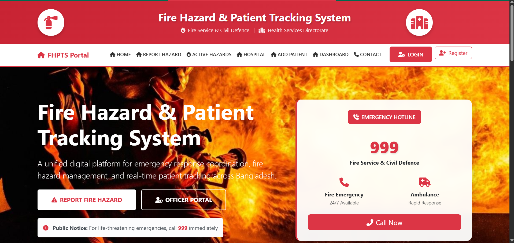

### Report a hazard
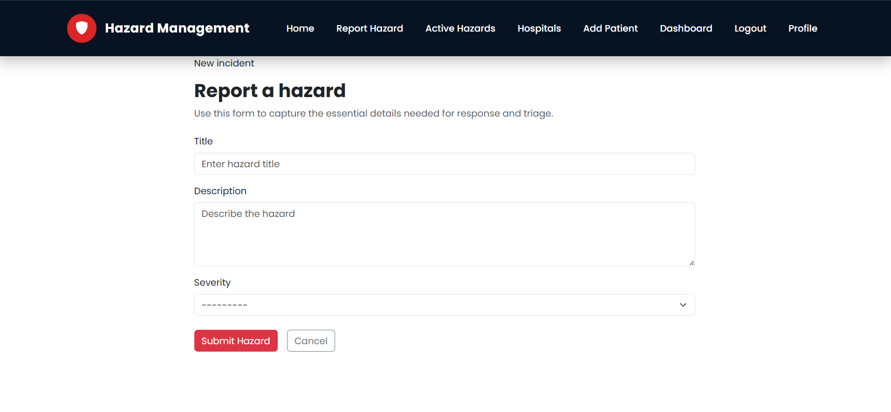

### Hazard Monitoring
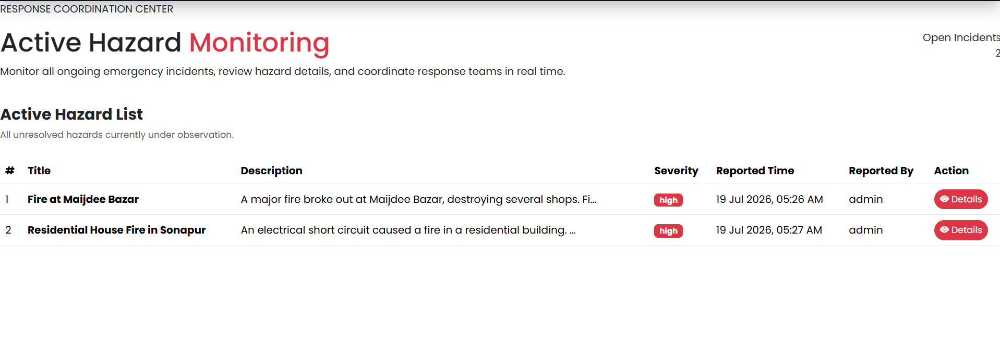

### details hazard
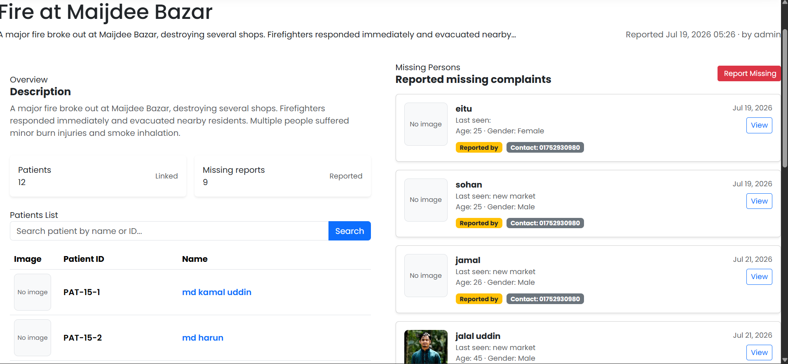

### Patients Details
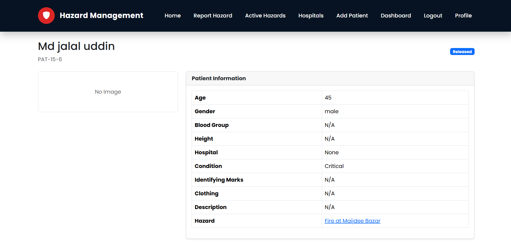
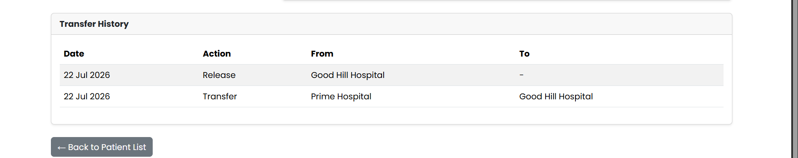

### add patients
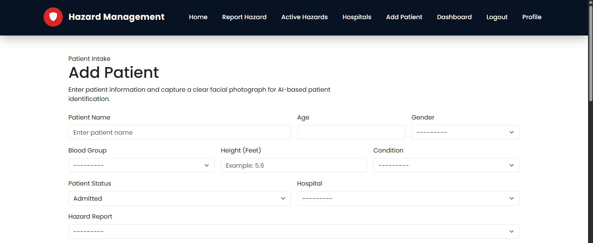
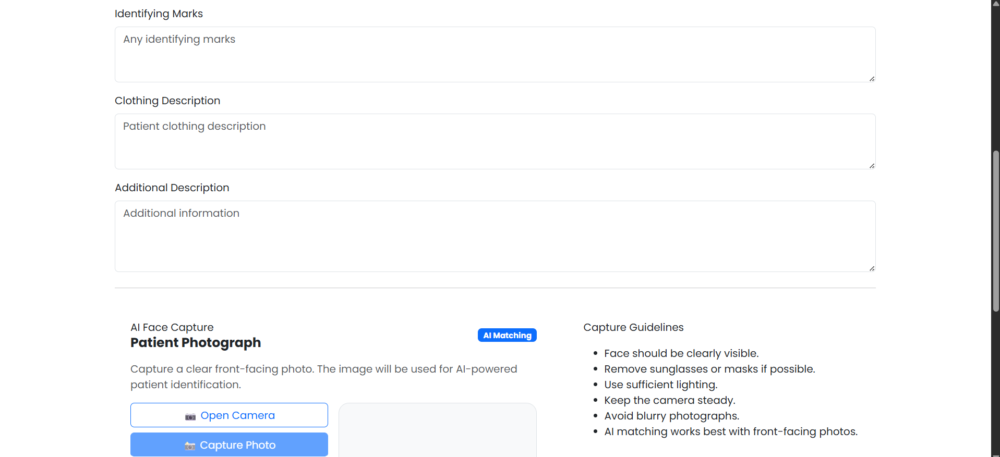
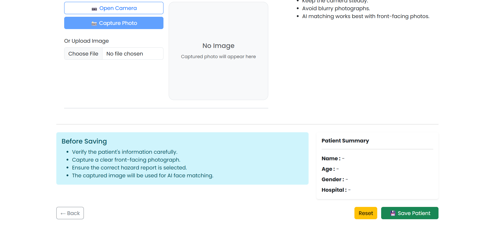

### General User Profile
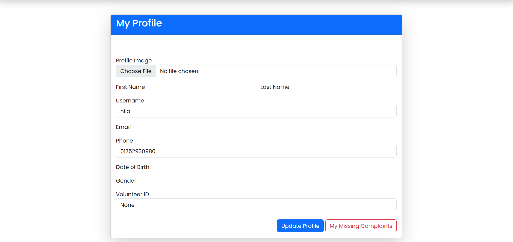

### General User missing complain
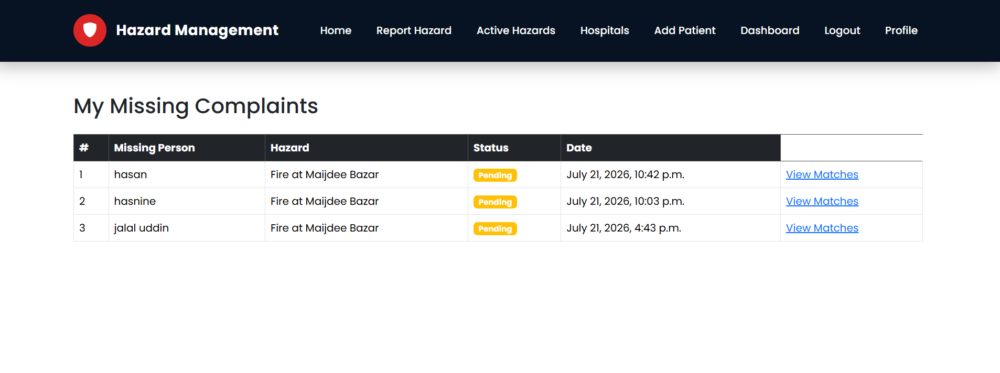


### AI Match dashboard
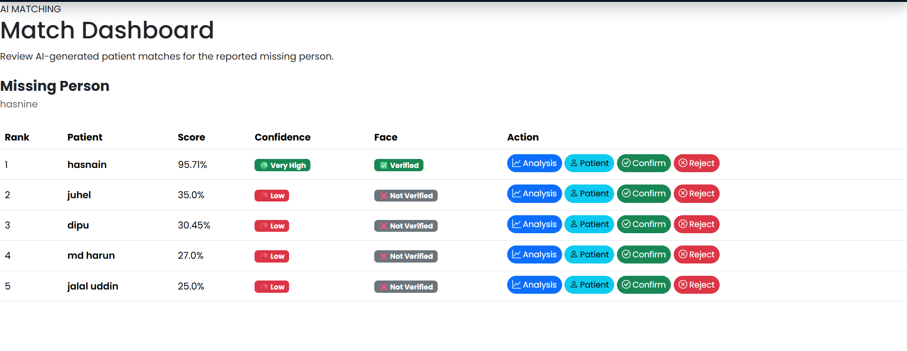

### Matching Analysis Report
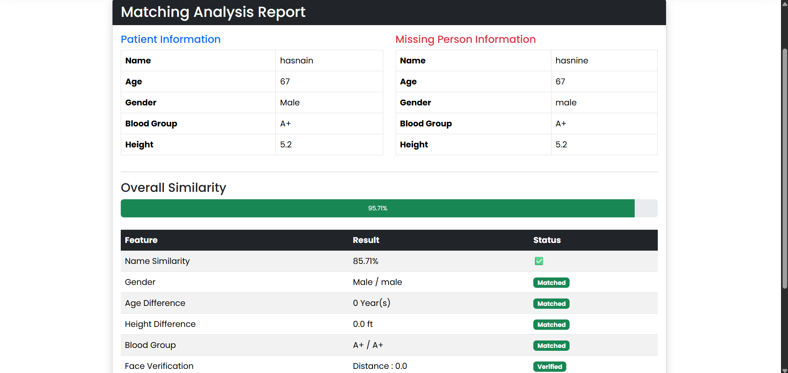


### Dashboard
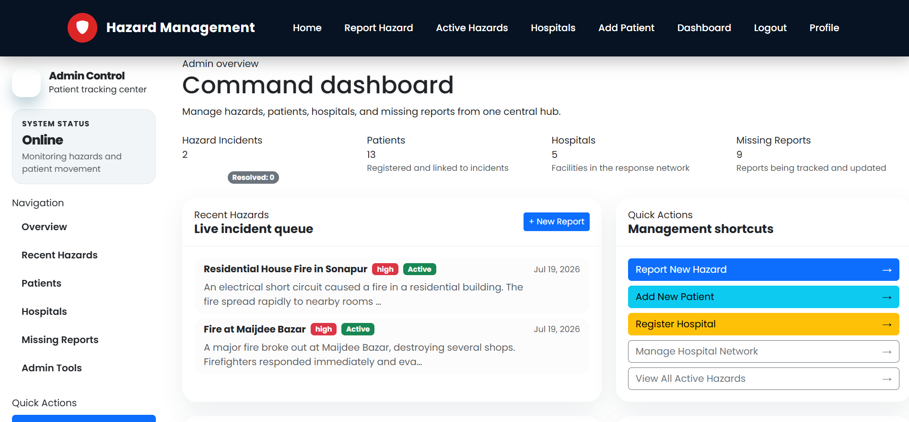

### Hospital
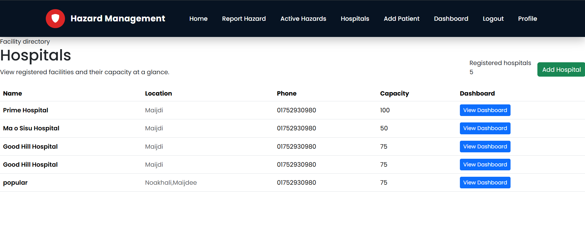

### Hospital Dashboard
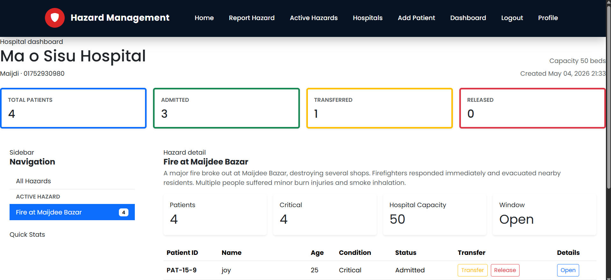
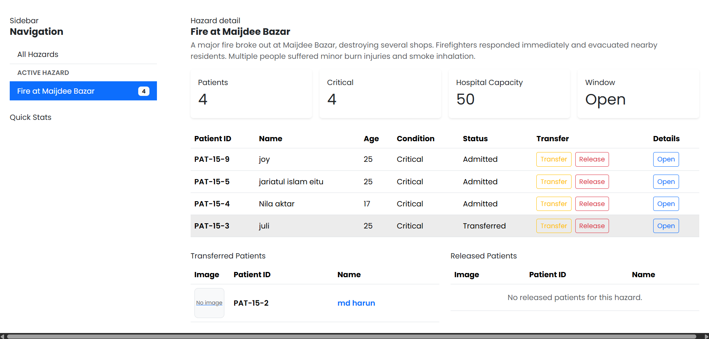


---

##  Installation

Clone the repository

```bash
git clone https://github.com/rehansohan/hazard-management-patient-trackinng-system.git
```

Move into the project directory

```bash
cd hazard-management-patient-trackinng-system
```

Create a virtual environment

```bash
python -m venv venv
```

### Windows

```bash
venv\Scripts\activate
```

### Linux/macOS

```bash
source venv/bin/activate
```

Install dependencies

```bash
pip install -r requirements.txt
```

Run migrations

```bash
python manage.py migrate
```

Run the development server

```bash
python manage.py runserver
```

---

##  Future Enhancements

- GIS-based hazard visualization
- Email & SMS notifications
- Mobile application
- Cloud image storage
- Real-time emergency notifications
- Performance optimization
- PostgreSQL deployment

---

##  Author

**Emon Hossen Sohan**

GitHub: https://github.com/rehansohan

---

##  License

This project is developed for educational and research purposes.